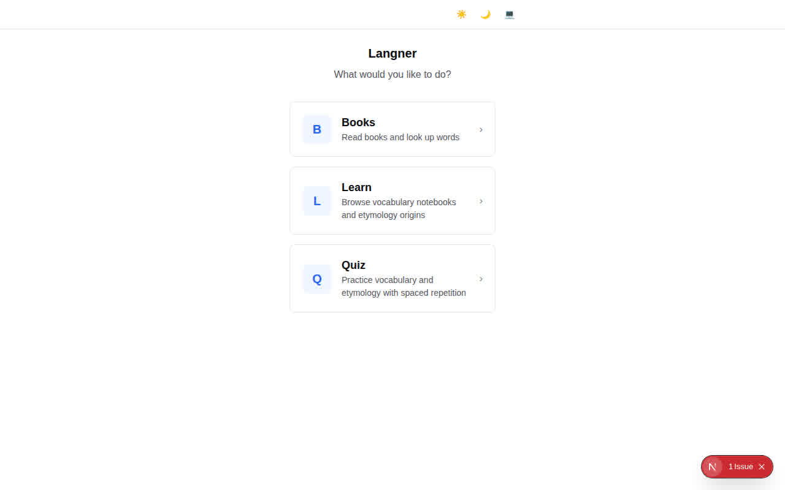
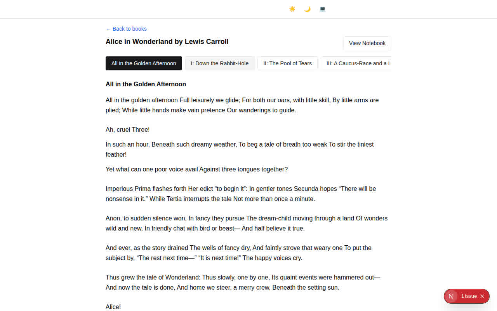
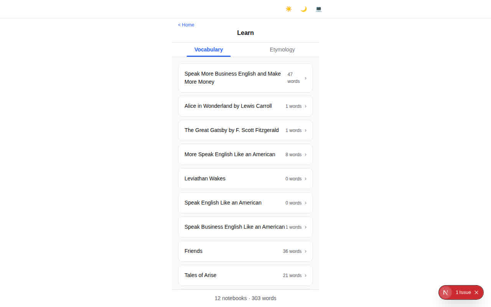
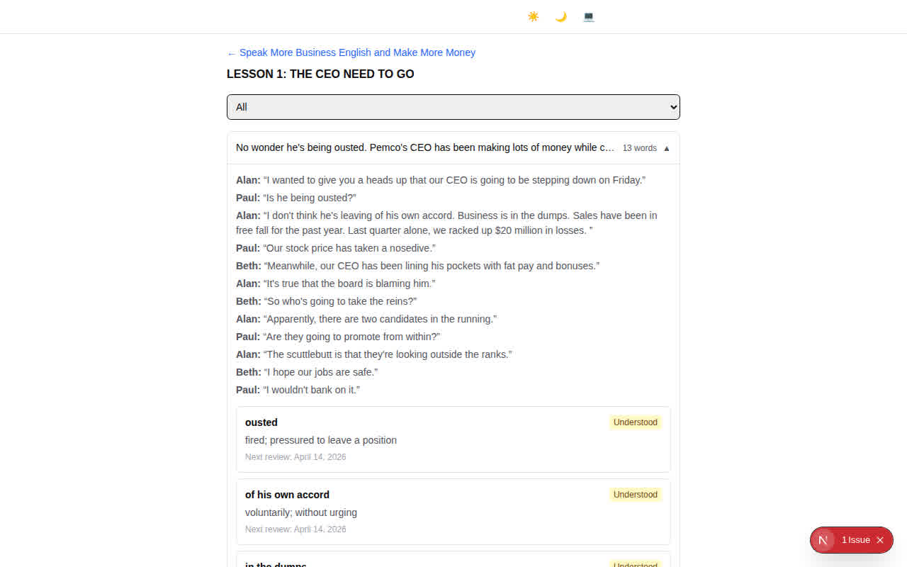
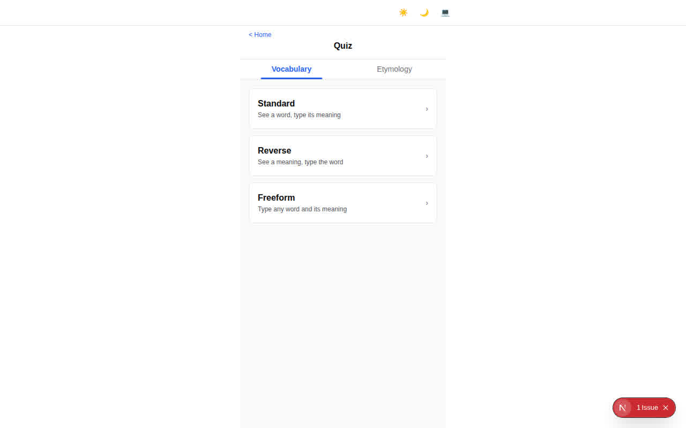
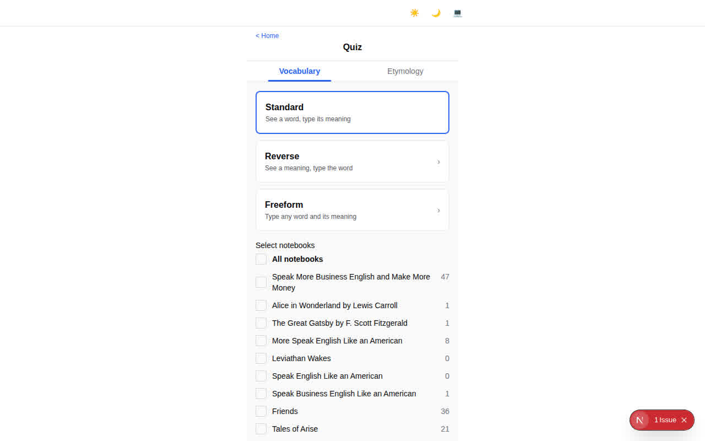

# Langner

[](https://github.com/at-ishikawa/langner/actions/workflows/pr.yml)

A vocabulary learning app that helps you learn English words and phrases from stories you enjoy.



## Why Langner?

Most vocabulary apps give you random word lists with no context. Langner takes a different approach:

1. **Learn words from stories you care about** - Create notebooks from books, TV shows, or articles you're actually reading. Words stick better when you learn them in context rather than from isolated flashcards.
2. **Don't waste time on words you already know** - A spaced repetition system tracks what you know and what you don't. Words you've mastered stop showing up, so you spend time only on what needs practice.
3. **Export PDFs to study anywhere** - Generate printable study materials from your notebooks so you can review on any device, even offline.

## Getting Started

### Prerequisites

- [Docker](https://docs.docker.com/get-docker/)
- [Go](https://golang.org/doc/install) (1.25+)
- [Node.js](https://nodejs.org/) and [pnpm](https://pnpm.io/installation)

### Setup

```bash
cp config.example.yml config.yml
make setup
```

This starts the database, installs dependencies, and runs migrations.

### Running

```bash
export OPENAI_API_KEY="your-api-key-here"
make dev
```

To grade quizzes with Google Gemini instead of OpenAI:

```bash
INFERENCE_MODE=gemini GEMINI_API_KEY="your-gemini-key-here" make dev
```

`INFERENCE_MODE` overrides `inference.mode` from `config.yml` and accepts
`openai` (default), `gemini`, or `mock`. `make dev` requires the API key for the
selected mode (`OPENAI_API_KEY` for openai, `GEMINI_API_KEY` for gemini, none for
mock).

- **Frontend**: http://localhost:3000
- **Backend**: http://localhost:8080

## Adding a Book

Langner uses books from [Standard Ebooks](https://standardebooks.org/). Add a book with the CLI:

```bash
langner ebook clone https://standardebooks.org/ebooks/mary-shelley/frankenstein
```

This clones the ebook so you can read it in the web UI. You can also list and remove books:

```bash
langner ebook list
langner ebook remove <id>
```

## Building Your Notebook

There are two ways to build vocabulary notebooks:

**From books** - As you read a book in the web UI, select any word to look it up. Save the definition and it's added to a notebook for that book automatically.

**From YAML files** - Create your own notebooks as YAML files for vocabulary from any source (TV shows, articles, podcasts, etc.). Place them in the directories configured in `config.yml`. See the `examples/` directory for the supported formats:

- `examples/stories/` - Story notebooks with conversations and scenes
- `examples/flashcards/` - Simple vocabulary card lists

Saved words from both sources appear in the Learn section and are available for quizzes.

## Features

### Books

Read books directly in the app. Select any word or phrase in the text to look it up in the dictionary, then save definitions to your notebook for later study.

- Browse your book library
- Read chapters with an interactive reader
- Tap any word to see its definition, pronunciation, examples, synonyms, and antonyms
- Save words to your notebook with one click



### Learn

Browse your vocabulary and etymology notebooks to review what you've been studying.

**Vocabulary** - View all saved words organized by the stories and scenes where you found them. Each word shows its definition, pronunciation, examples, learning status, and next review date.

**Journals** - Your own journal entries live on their own tab, separate from your vocabulary. Open a journal to read its story back as prose and review the grammar mistakes found in it. For any mistake you can tap **Exclude from quizzes** to stop it from appearing in future grammar quizzes and review, or **Resume** to bring it back.

**Etymology** - Explore word origins (roots, prefixes, suffixes). Browse by origin or by meaning to see how words are related. Each word has an **Exclude from quizzes** / **Resume** control, so you can drop a word you already know from its origin family review and add it back whenever you like.





### Quiz

Test yourself with several quiz modes, all powered by spaced repetition:

**Vocabulary Quizzes**
- **Standard** - See a word, type its meaning
- **Reverse** - See a meaning and context, type the word
- **Freeform** - Recall any word and its meaning from memory

Words with etymology origins are quizzed as part of these vocabulary quizzes, and each word's origin (its roots, prefixes, and suffixes with their meanings) is shown in the feedback.

**Relearn**
- Re-drill the words you recently missed across every quiz mode. Words that share an etymology origin are grouped into one card — showing the origin, its meaning, and just the words you missed under it — so you can study a whole word family together. Relearn is practice only: it never changes your review schedule.

Choose how many answers to review at once on the start screen (default 10). You can also narrow a quiz to specific chapters or episodes within a notebook by expanding the notebook on the start screen and ticking only the sections you want — useful when you want to drill the most recent episode you read. After every batch, a feedback screen shows your answers with the correct meanings, examples, and pronunciation — you can mark answers correct or incorrect, exclude words from future quizzes, or undo overrides, then continue to the next batch or jump to the final results. Freeform quizzes still show feedback after each answer.

At the end of a session, a results page shows your score and lets you review incorrect answers.





### Export PDF

From any notebook page, export a formatted PDF with all your words, definitions, examples, and pronunciations. Useful for offline review or printing.

## Configuration

Edit `config.yml` to set your directories for notebooks, dictionaries, templates, and outputs. See `config.example.yml` for all available options.

### Environment Variables

| Variable | Required For | Description |
|----------|-------------|-------------|
| `INFERENCE_MODE` | Quizzes (optional) | Overrides `inference.mode`; one of `openai` (default), `gemini`, `mock` |
| `OPENAI_API_KEY` | Quizzes (OpenAI) | OpenAI API key for quiz answer evaluation |
| `OPENAI_MODEL` | Quizzes (optional) | OpenAI model, defaults to `gpt-4o-mini` |
| `GEMINI_API_KEY` | Quizzes (Gemini) | Google Gemini API key, used when `inference.mode: gemini` |
| `GEMINI_MODEL` | Quizzes (optional) | Gemini model, defaults to the free-tier `gemini-2.0-flash` |
| `RAPID_API_HOST` | Dictionary lookup | Set to `wordsapiv1.p.rapidapi.com` |
| `RAPID_API_KEY` | Dictionary lookup | Get at [RapidAPI](https://rapidapi.com/dpventures/api/wordsapi) |

Quiz grading uses OpenAI by default. To use Google Gemini instead, set `inference.mode: gemini` in `config.yml` (or `INFERENCE_MODE=gemini` in the environment) and export `GEMINI_API_KEY` (see `config.example.yml`).

## License

This project is licensed under the MIT License. See the LICENSE file for details.
